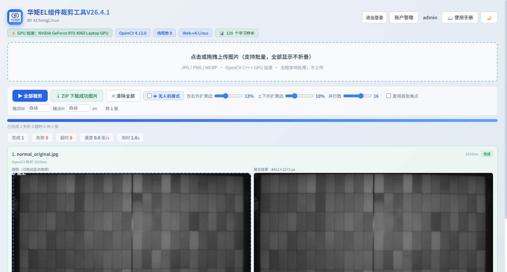
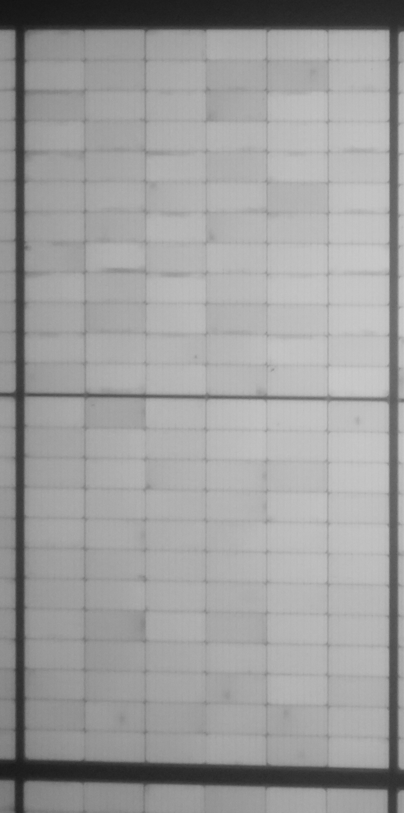
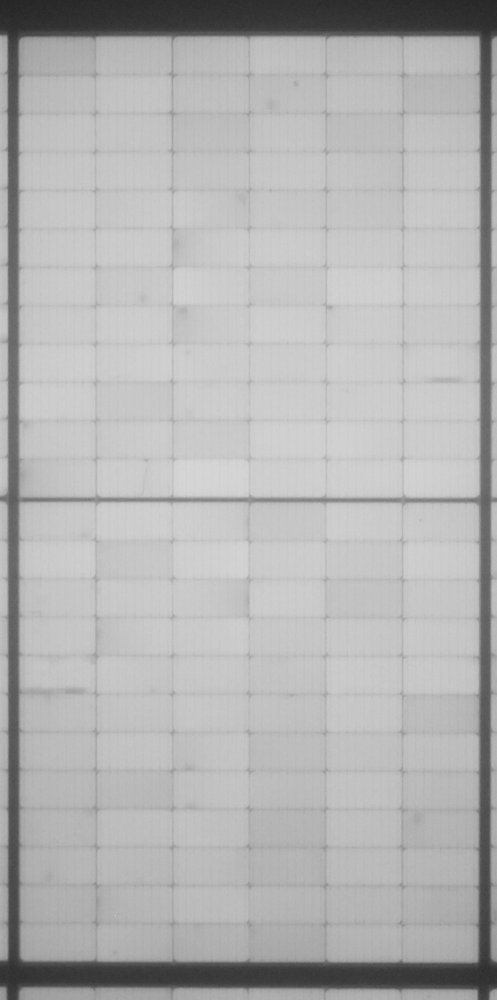
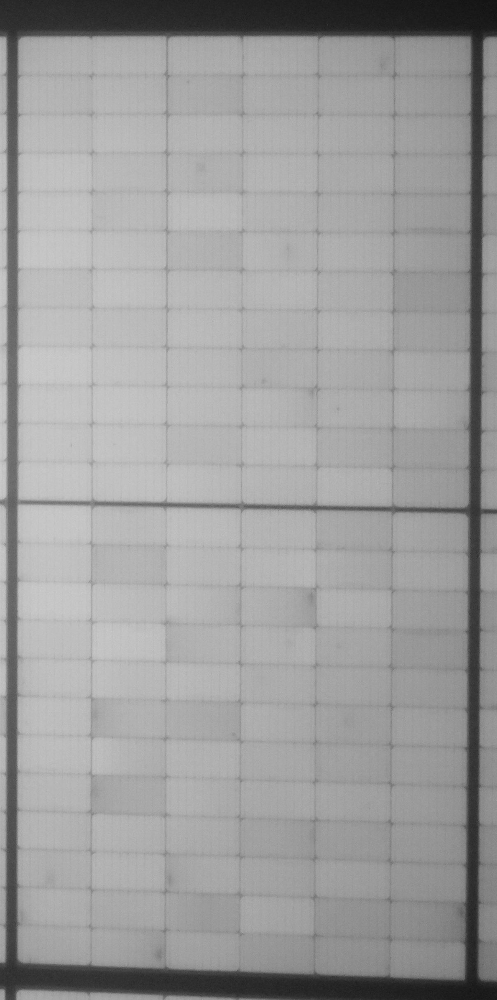
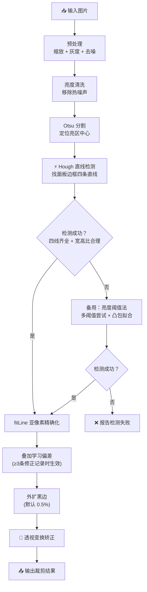
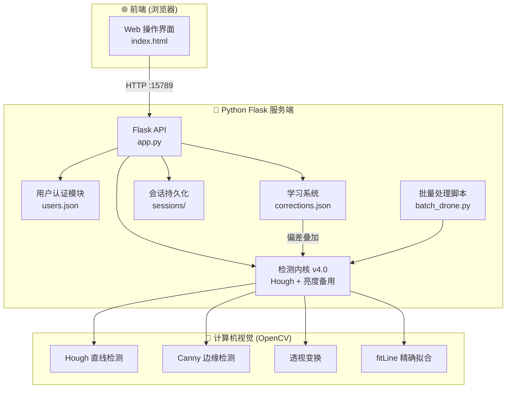

# 华矩EL测试仪 — 太阳能电池板 EL 检测图像自动裁剪工具

<p align="center">
  
</p>

<p align="center">
  <a href="http://el.acheng9616.com/">🌐 项目介绍页</a>
  ·
  <a href="#快速开始">🚀 快速开始</a>
  ·
  <a href="#功能特性">✨ 功能特性</a>
  ·
  <a href="#界面预览">📷 界面预览</a>
</p>

基于计算机视觉的智能裁剪工具，自动检测电致发光（EL）照片中太阳能电池面板的四个角点，通过透视变换矫正为规整矩形。支持**普通拍摄**和**无人机拍摄**两种模式。

---

## 界面预览

| 登录页面 | 主界面 · 上传 | 处理中 | 裁剪完成 |
|:---:|:---:|:---:|:---:|
|  |  |  |  |

> 📸 更多界面截图请访问 [el.acheng9616.com](http://el.acheng9616.com/)

## 功能特性

- **🔍 自动角点检测** — 基于 Hough 直线检测 + Otsu 亮度阈值双算法，精准定位面板边框，失败时自动降级
- **🔄 透视变换矫正** — 将倾斜拍摄的面板矫正为标准矩形，支持水平/垂直外扩比例独立调节
- **✈️ 无人机模式** — 一张包含多个面板的无人机 EL 照片自动裁出左、中、右最多 3 块独立面板
- **🧠 学习系统** — 记录用户手动修正，积累 ≥3 条后自动叠加偏差优化后续检测
- **⚡ GPU 硬件加速** — 自动使用 OpenCL 加速，300 张图片 GPU 仅需 30~90 秒
- **🌐 Web 操作界面** — Flask 后端提供 Web 服务，局域网内任何设备均可访问使用
- **👥 用户管理** — 管理员/普通用户两级权限，支持创建用户和修改密码
- **💾 会话持久化** — 关闭浏览器后自动恢复上次处理进度，支持批量多线程处理

## 处理效果展示

<p align="center">
  <strong>无人机模式</strong>：一张照片自动裁出左、中、右三块独立面板
</p>

<p align="center">
  
  
  
</p>

## 检测内核 v4.0

| 算法 | 状态 | 说明 |
|------|------|------|
| Hough 直线检测 | 主算法 | 找面板边框的四条直线，交点即为角点 |
| Otsu 亮度阈值 | 备用 | Hough 失败时自动降级使用 |
| fitLine 精确化 | 后处理 | 对每条边做亚像素级精确拟合 |
| 学习偏差 | 叠加 | 用户手动修正积累 ≥3 条后自动应用 |

### 检测流程


```mermaid
flowchart TB
    IN["📥 输入图片"] --> PRE["预处理\n缩放 + 灰度 + 去噪"]
    PRE --> CLEAN["亮度清洗\n移除热噪声"]
    CLEAN --> OTSUSEG["Otsu 分割\n定位亮区中心"]
    OTSUSEG --> HOUGH["⚡ Hough 直线检测\n找面板边框四条直线"]
    HOUGH --> CHECK{"检测成功？\n四线齐全 + 宽高比合理"}
    CHECK -->|"是"| FIT["fitLine 亚像素精确化"]
    CHECK -->|"否"| BRIGHT["备用：亮度阈值法\n多阈值尝试 + 凸包拟合"]
    BRIGHT --> CHECK2{"检测成功？"}
    CHECK2 -->|"是"| FIT
    CHECK2 -->|"否"| FAIL["❌ 报告检测失败"]
    FIT --> BIAS["叠加学习偏差\n(≥3条修正记录时生效)"]
    BIAS --> PAD["外扩黑边\n(默认 0.5%)"]
    PAD --> WARP["🔄 透视变换矫正"]
    WARP --> OUT["📤 输出裁剪结果"]
```

## 系统架构

### 架构图


```mermaid
flowchart TB
    subgraph Frontend["🌐 前端 (浏览器)"]
        UI["Web 操作界面\nindex.html"]
    end

    subgraph Backend["🐍 Python Flask 服务端"]
        API["Flask API\napp.py"]
        AUTH["用户认证模块\nusers.json"]
        DETECT["检测内核 v4.0\nHough + 亮度备用"]
        LEARN["学习系统\ncorrections.json"]
        SESSION["会话持久化\nsessions/"]
        BATCH["批量处理脚本\nbatch_drone.py"]
    end

    subgraph CV["📐 计算机视觉 (OpenCV)"]
        HOUGH["Hough 直线检测"]
        CANNY["Canny 边缘检测"]
        WARP_CV["透视变换"]
        FITLINE["fitLine 精确拟合"]
    end

    UI -->|"HTTP :15789"| API
    API --> AUTH
    API --> DETECT
    API --> SESSION
    DETECT --> HOUGH
    DETECT --> CANNY
    DETECT --> WARP_CV
    DETECT --> FITLINE
    API --> LEARN
    LEARN -->|"偏差叠加"| DETECT
    BATCH --> DETECT
```

### 项目结构

```
华矩EL测试仪/
├── index.html                  # 🌟 项目介绍页（GitHub Pages）
├── CNAME                       # 自定义域名配置
├── images/                     # 介绍页图片资源
│   ├── logo.png
│   ├── hero-bg.jpg
│   ├── 01_login.png ~ 09_overview.png
│   ├── drone_*.jpg
│   └── normal_original.jpg
│
├── 华矩EL裁剪工具(离线版)/      # 📦 离线版主程序
│   ├── EL裁剪工具-离线版.exe    # 双击启动，自动打开浏览器
│   ├── 使用建议.txt             # 使用说明
│   ├── runtime/                # Python 运行时
│   └── app/
│       ├── app.py              # Flask 后端主程序
│       ├── index.html          # 工具操作界面
│       └── tools/              # 工具模块
└── README.md
```

## 快速开始

### 环境要求

- Windows 10 / 11（64 位）
- 无需安装 Python 或其他依赖，内置完整运行环境

### 安装与启动

#### 第一步：下载离线版

从下载链接获取 **`EL裁剪工具-离线版.exe`**（约 120 MB，含完整运行环境）。

#### 第二步：启动工具

双击 **`EL裁剪工具-离线版.exe`**，浏览器将自动打开工具界面（约 2～5 秒）。

若未自动打开，请手动访问 `http://127.0.0.1:15789`。

### 操作流程

1. **上传图片** — 点击上传或拖拽 EL 检测照片到网页
2. **自动裁剪** — 系统自动检测面板角点并矫正
3. **手动修正**（可选）— 拖拽橙色角点调整检测位置
4. **下载结果** — 保存裁剪后的面板图片

### 性能参考

| 模式 | 300张耗时 |
|------|-----------|
| GPU 加速 | 30~90 秒 |
| CPU 模式 | 3~5 分钟 |

## 技术栈

| 组件 | 技术 |
|------|------|
| 后端框架 | Python 3.8 + Flask |
| 计算机视觉 | OpenCV 4.x（NumPy） |
| 硬件加速 | OpenCL（可选） |
| 前端界面 | 纯 HTML / JavaScript |
| 介绍页部署 | GitHub Pages + 自定义域名 |

## 许可证

本项目基于 **MIT 许可证** 开源。

```
MIT License

Copyright (c) 2026 华矩EL测试仪
```
